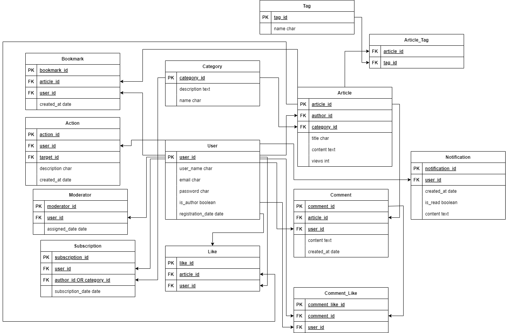

# mdisubd
Новостной портал
## Евдоковец Андрей, 253505
ФКСиС ИиТП, 2024г.

# Функциональные возможности проекта

Проект представляет собой новостной сайт с возможностью взаимодействия пользователей с контентом. Основные функциональные возможности включают:

## 1. Регистрация и авторизация пользователей
- Пользователи могут создавать учетные записи, вводя уникальные логин и email.
- Авторизация осуществляется по email и паролю.

## 2. Создание и управление статьями
- **Авторы** могут создавать статьи, указывая заголовок, содержание и категорию.
- Каждая статья может иметь теги для улучшения навигации по сайту.
- Подсчет количества просмотров статьи.
- Пользователи могут редактировать и удалять свои статьи.

## 3. Категории и теги
- Все статьи организованы по категориям для легкой фильтрации контента.
- Пользователи могут просматривать статьи по категориям.
- Возможность добавления тегов к статьям для улучшения поиска.

## 4. Лайки и комментарии
- Пользователи могут ставить лайки статьям, поддерживая интересный контент.
- Возможность комментирования статей.
- Лайки для комментариев, поддержка полезных комментариев.

## 5. Закладки
- Пользователи могут сохранять интересные статьи в закладки для последующего чтения.

## 6. Подписки
- Подписка на авторов для получения уведомлений о новых статьях.
- Подписка на категории для отслеживания новых публикаций в интересующих темах.

## 7. Уведомления
- Система уведомлений о новых статьях от авторов, на которых подписан пользователь.
- Уведомления о новых комментариях к статьям.

## 8. Управление пользователями и модерация
- **Модераторы** могут редактировать или удалять комментарии для поддержания порядка.
- Пользователи могут быть обычными пользователемя, авторами, а также модераторами для управления контентом.
- Журналирование действий пользователей

## Сущности и описание их полей

### 1. **User (Пользователь)**
- **Attributes**:
   - `user_id` (PK): Уникальный идентификатор пользователя.
  - `username` (VARCHAR, уникальный): Имя пользователя.
  - `email` (VARCHAR, уникальный): Адрес электронной почты пользователя.
  - `password_hash` (VARCHAR): Хэш пароля.
  - `is_author` (BOOLEAN): Флаг, указывающий, является ли пользователь автором.
  - `registration_date` (DATE): Дата регистрации пользователя.
- **Relationships**:
  - One-to-Many with `Article`: One user can write many articles.
  - One-to-Many with `Comment`: One user can post many comments.
  - One-to-Many with `Like`: One user can like many articles.
  - One-to-Many with `Subscription`: One user can subscribe to many authors.
  - One-to-Many with `Bookmark`: One user can bookmark many articles.
  - One-to-Many with `Notification`: One user can receive many notifications.
  - One-to-One with `Moderator`: One user can be assigned as a moderator.
  - One-to-Many with `Comment_Like`: One user can like many comments.
  - One-to-Many with `Category_Subscription`: One user can subscribe to many categories.

### 2. **Article (Статья)**
- **Attributes**:
  - `article_id` (PK): Уникальный идентификатор статьи.
  - `title` (VARCHAR): Заголовок статьи.
  - `content` (TEXT): Содержание статьи.
  - `publication_date` (DATE): Дата публикации статьи.
  - `author_id` (FK): Идентификатор автора (ссылка на `User`).
  - `category_id` (FK): Идентификатор категории статьи (ссылка на `Category`).
  - `views` (INT): Количество просмотров статьи.
- **Relationships**:
  - Many-to-One with `User`: One article is written by one author.
  - One-to-Many with `Comment`: One article can have many comments.
  - One-to-Many with `Like`: One article can receive many likes.
  - Many-to-Many with `Tag`: One article can have many tags.
  - One-to-Many with `Bookmark`: One article can be bookmarked by many users.

### 3. **Comment (Комментарий)**
- **Attributes**:
  - `comment_id` (PK): Уникальный идентификатор комментария.
  - `content` (TEXT): Текст комментария.
  - `created_at` (DATE): Дата создания комментария.
  - `article_id` (FK): Идентификатор статьи, к которой относится комментарий (ссылка на `Article`).
  - `user_id` (FK): Идентификатор пользователя, оставившего комментарий (ссылка на `User`).
- **Relationships**:
  - Many-to-One with `Article`: One comment belongs to one article.
  - Many-to-One with `User`: One comment belongs to one user.
  - One-to-Many with `Comment_Like`: One comment can receive many likes.

### 4. **Like (Лайк)**
- **Attributes**:
  - `like_id` (PK): Уникальный идентификатор лайка.
  - `user_id` (FK): Идентификатор пользователя, поставившего лайк (ссылка на `User`).
  - `article_id` (FK): Идентификатор статьи, получившей лайк (ссылка на `Article`).
- **Relationships**:
  - Many-to-One with `User`: One like is given by one user.
  - Many-to-One with `Article`: One like belongs to one article.

### 5. **Category (Категория)**
- **Attributes**:
  - `category_id` (PK): Уникальный идентификатор категории.
  - `name` (VARCHAR): Название категории.
  - `description` (TEXT): Описание категории.
- **Relationships**:
  - One-to-Many with `Article`: One category can include many articles.
  - One-to-Many with `Category_Subscription`: One category can have many subscribers.

### **Article_Tag (Связь Статья-Тег)**
- **Attributes**:
  - `article_id` (FK): Идентификатор статьи (ссылка на `Article`).
  - `tag_id` (FK): Идентификатор тега (ссылка на `Tag`).
- **Rels**:
  - Одна статья может иметь множество тегов.
  - Один тег может быть присвоен множеству статей.

### 6. **Tag (Тег)**
- **Attributes**:
  - `tag_id` (PK): Unique identifier.
  - `name` (VARCHAR): Tag name.
- **Relationships**:
  - Many-to-Many with `Article`:  Один тег может быть присвоен множеству статей через сущность `Article_Tag`. 

### 7. **Bookmark (Закладка)**
- **Attributes**:
  - `bookmark_id` (PK): Уникальный идентификатор закладки.
  - `user_id` (FK): Идентификатор пользователя, добавившего статью в закладки (ссылка на `User`).
  - `article_id` (FK): Идентификатор статьи, добавленной в закладки (ссылка на `Article`).
  - `created_at` (TIMESTAMP): Дата и время, когда статья была добавлена в закладки.
- **Relationships**:
  - Many-to-One with `User`: One bookmark belongs to one user.
  - Many-to-One with `Article`: One bookmark belongs to one article.

### 8. **Subscription (Подписка на автора)**
- **Attributes**:
  - `subscription_id` (PK): Уникальный идентификатор подписки.
  - `subscriber_id` (FK): Идентификатор подписчика (ссылка на `User`).
  - `author_id` (FK): Идентификатор автора, на которого подписан пользователь (ссылка на `User`).
  - `subscription_date` (DATE): Дата подписки.
- **Relationships**:
  - Many-to-One with `User`: One subscription belongs to one user and one author.

### 9. **Notification (Уведомление)**
- **Attributes**:
  - `notification_id` (PK): Уникальный идентификатор уведомления.
  - `content` (TEXT): Текст уведомления (например, "Новая статья от автора X").
  - `user_id` (FK): Идентификатор пользователя, который получает уведомление (ссылка на `User`).
  - `created_at` (DATE): Дата создания уведомления.
  - `is_read` (BOOLEAN): Флаг, указывающий, было ли прочитано уведомление.
- **Relationships**:
  - Many-to-One with `User`: One notification belongs to one user.

### 10. **Category_Subscription (Подписка на категорию)**
- **Attributes**:
  - `subscription_id` (PK): Уникальный идентификатор подписки на категорию.
  - `user_id` (FK): Идентификатор пользователя (ссылка на `User`).
  - `category_id` (FK): Идентификатор категории (ссылка на `Category`).
  - `subscription_date` (DATE): Дата подписки.
- **Relationships**:
  - Many-to-One with `User`: One category subscription belongs to one user.
  - Many-to-One with `Category`: One category subscription belongs to one category.

### 11. **Comment_Like (Лайк Комментария)**
- **Attributes**:
  - `comment_like_id` (PK): Уникальный идентификатор лайка комментария.
  - `comment_id` (FK): Идентификатор комментария (ссылка на `Comment`).
  - `user_id` (FK): Идентификатор пользователя, поставившего лайк (ссылка на `User`).
- **Relationships**:
  - Many-to-One with `Comment`: One comment like belongs to one comment.
  - Many-to-One with `User`: One comment like belongs to one user.

### 12. **Moderator (Модератор)**
- **Attributes**:
  - `moderator_id` (PK): Уникальный идентификатор модератора.
  - `user_id` (FK): Идентификатор пользователя, назначенного модера
- **Relationships**:
  - One-to-One with `User`: One moderator is one user.
    
### 13. **Action (Действие)**
- **Attributes**:
  - `action_id` (PK): Уникальный идентификатор.
  - `user_id` (FK): Идентификатор пользователя, который совершает действие
  - `target_id` (FK): Идентификатор статьи/комментария
  - `description` (VARCHAR): Описание действия
  - `created_at` (DATE)
- **Relationships**:
  - Many-to-One with `User`: One user commits many actions.
 

